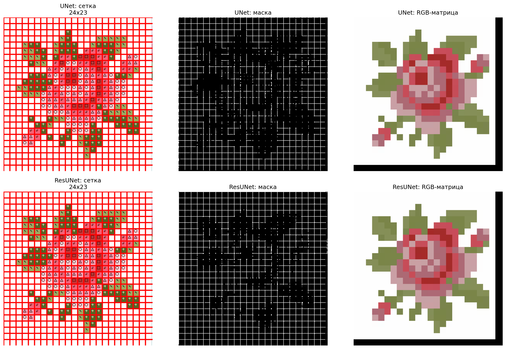
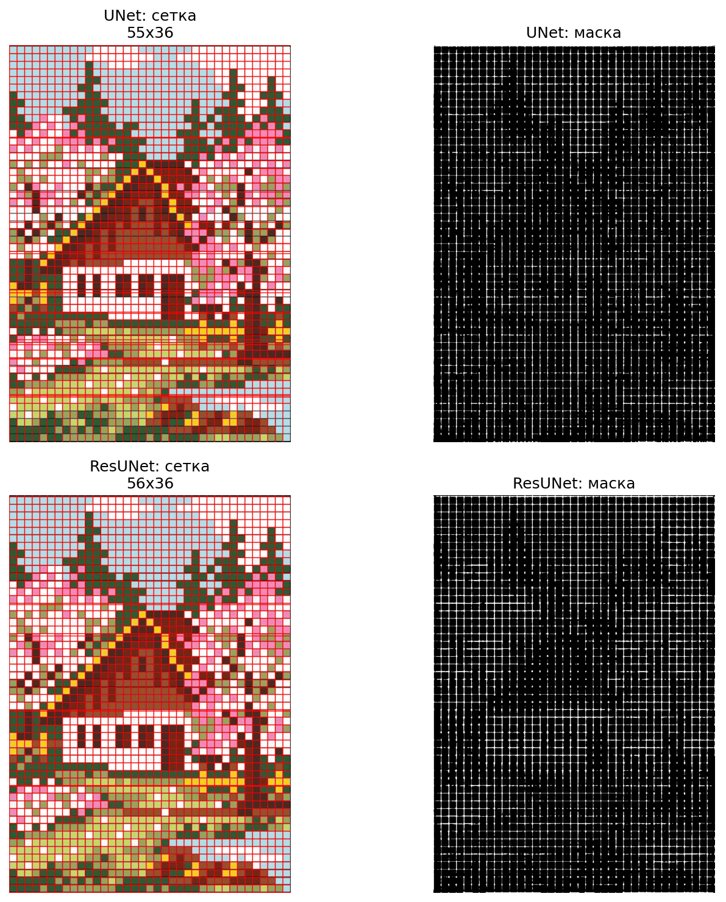

# 🧵 Cross‑Stitch Grid Digitizer

В работе рассматривается задача автоматического перевода бумажных схем для вышивки крестиком в цифровой формат. Схемы представляют собой цветные таблицы с ячейками, содержащими символы и цветовые обозначения, соответствующие нитям. Предлагается конвейер обработки изображений на основе OpenCV и методов машинного обучения, включающий сегментацию ячеек, распознавание символов и кластеризацию цветов. Разрабатываемый инструмент позволит сократить время оцифровки с нескольких часов до минут.

[](https://www.python.org/downloads/)
[](https://pytorch.org/)
[](LICENSE)
[](https://arxiv.org/abs/2505.12345)

> Автоматическая оцифровка бумажных схем для вышивки крестиком с помощью свёрточных нейросетей (U‑Net, ResU‑Net) и классической постобработки.

<div align="center">
  
  <br>
  <sub>Пример работы: слева направо — исходная схема, предсказанная маска, наложенная сетка и восстановленная RGB‑матрица цветов ячеек.</sub>
</div>

---

## 📌 О проекте

Оцифровка бумажных схем для вышивки — долгий и утомительный процесс. Этот проект автоматизирует первый и самый важный этап: **детекцию линий сетки**. Мы сравниваем две архитектуры нейросетей — классический **U‑Net** и **ResU‑Net** — а затем с помощью постобработки (Hough, группировка, восстановление линий) превращаем предсказанные маски в готовую сетку и RGB‑матрицу цветов.

**Основные возможности:**

* ✅ Детекция линий сетки на зашумлённых цветных схемах.
* ✅ Сравнение двух архитектур: U‑Net и ResU‑Net.
* ✅ Полная постобработка: HoughLinesP → группировка → восстановление пропущенных линий → выравнивание ячеек.
* ✅ Визуализация результатов (сетка на оригинале, маска, RGB‑матрица).
* ✅ Экспорт в JSON / CSV / PNG.
* ✅ Графический редактор для ручной коррекции (CrossStitch Pro).

---

## 🏆 Результаты

Мы обучили обе модели на датасете из **70 размеченных схем** (56 train / 14 val) и сравнили их по метрикам IoU, Dice, Precision и Recall. **Лучшие результаты показал ResU‑Net:**

| Метрика | U‑Net | ResU‑Net | Преимущество ResU‑Net |
|:--------|:-----:|:--------:|:---------------------:|
| **Dice** | 0.415 | **0.548** | 🔼 **+32%** |
| **IoU** | 0.275 | **0.388** | 🔼 **+41%** |
| **Recall** | 0.285 | **0.408** | 🔼 **+43%** |
| **Precision** | 0.908 | 0.901 | ≈ сопоставима |

<div align="center">
  
  <br>
  <sub>Визуализация сравнения: исходное изображение, маска U‑Net, маска ResU‑Net.</sub>
</div>

---

## 🧠 Архитектура пайплайна

Проект состоит из четырёх основных этапов:

1. **Обучение нейросети** – U‑Net / ResU‑Net для бинарной сегментации (линия / фон).
2. **Постобработка** – HoughLinesP, группировка, восстановление и выравнивание линий.
3. **Извлечение цвета** – для каждой ячейки вычисляется доминирующий RGB‑цвет (среднее арифметическое).
4. **Визуализация и экспорт** – JSON / CSV / PNG.

## 📁 Структура репозитория

cross-stitch-digitizer/
├── architectures.py              # Классы UNet, ResUNet, фабрика моделей
├── train_experiment.py           # Скрипт обучения и сравнения
├── compare_models.py             # Тестирование обученных моделей
├── cross_stitch_editor.py        # Графический редактор схем
├── requirements.txt              # Зависимости
│
├── train_images/                 # Исходные схемы для обучения
├── train_masks/                  # Бинарные маски (ground truth)
├── val_images/                   # Схемы для валидации
├── val_masks/                    # Маски для валидации
├── test_images/                  # Тестовые схемы
├── results/                      # Результаты экспериментов
│   ├── comparison_*.png          # Визуализации сравнения
│   └── comparison_summary.json   # Итоговая таблица метрик
│
└── docs/     
    ├── teaser.png
    ├── comparison.png
    ├── pipeline.png 
    └── editor.png


---

## 🚀 Установка и запуск

### 1. Клонирование репозитория

```bash
git clone https://github.com/kicchhi/research.git
cd cross-stitch-digitizer
```

### 2. Установка зависимостей

```
pip install -r requirements.txt
```

### 3. Запуск обучения и сравнения

```
python train_experiment.py
```
### 4. Получение предсказания на новых изображениях

```
python compare_models.py
```
### 5. Графический редактор

```
python cross_stitch_editor.py
```

# 🎨 Графический редактор CrossStitch Pro
Простой и удобный редактор для визуального анализа и ручной коррекции схем:

- Загрузка JSON с результатами.
- Отображение сетки и RGB‑матрицы.
- Инструменты: кисть, ластик, пипетка, заливка, текст.
- Палитра цветов и история действий.

<div align="center">  </div>
